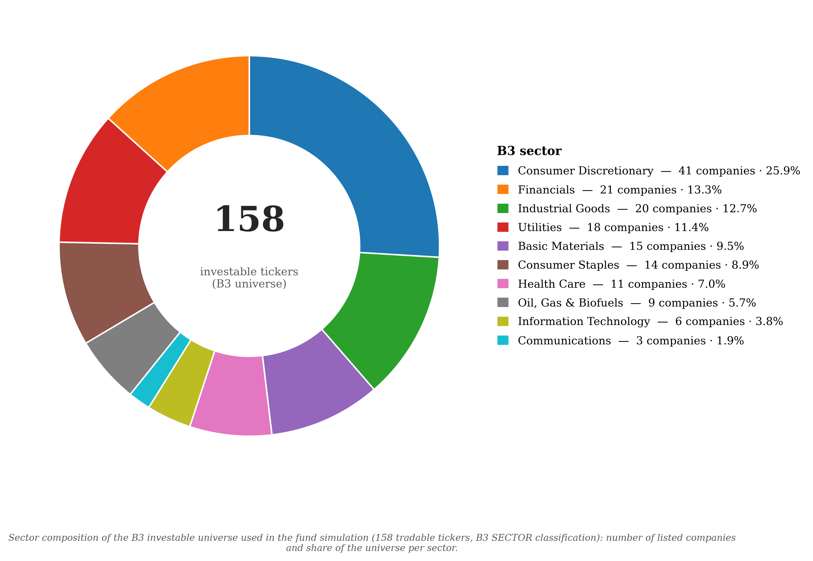

# OHRP-Temporary 📈

### Hi! This is the working mirror of the [OHRP](https://github.com/KgPergher98/OHRP) library 🤗

The original repository is **frozen while the accompanying manuscript is under review**, so this
temporary mirror carries the code in its current state — including **S-OHRP** and the **Sectoral
Gini Index**, which were developed after that freeze. Everything here reproduces the experiments
reported in my master's dissertation at PPGC/UFRGS.

As always, this is ongoing research and there is plenty left to improve. Contributions, questions
and issues are very welcome — please do get in touch. Only freely available data is included.

---

## What is in here 🧠

Three methods are implemented on top of the classical Hierarchical Risk Parity pipeline.

**OHRP — Orthogonal Hierarchical Risk Parity.** Instead of modifying the HRP machinery, OHRP
changes *what HRP sees*. Asset returns are projected onto a lower-dimensional orthogonal subspace
that preserves data locality (PCA followed by OLPP), and only then handed to hierarchical
clustering, quasi-diagonalization and recursive bisection. The projection parameters
`(k, d, r)` are re-optimized in-sample at **every** rebalancing, which turns a static
preprocessing step into an adaptive component of the strategy.

**S-OHRP — Sectoral OHRP.** A strict generalization of OHRP along two axes. First, the locality
graph only admits **intra-sector** edges, injecting an economic prior into the learned
representation and blocking the spurious cross-sector neighbours that hurt most when data are
scarce. Second, the in-sample selection is unified into a `δ·F` framework, where `δ` sets the
direction of the search and `F` is *any* scalar portfolio objective — so criteria such as the
Sharpe ratio become admissible alongside variance. Setting the sector partition to the whole
universe recovers OHRP exactly.

**SGI — Sectoral Gini Index.** A concentration measure that applies the Gini operator to
*sector-level aggregate weights*. It exposes something the asset-level Gini structurally cannot
see: a portfolio can be spread across dozens of tickers and still have its weight clustered in a
single economic sector. Running `tutorialSimpleOHRP.py` makes the point immediately — the equally
weighted portfolio scores a perfect `Gini = 0.00` and still lands at `SGI ≈ 0.31`.

---

## Out-of-sample results 📊

Cumulative returns of the six strategies at the one-year estimation window, the point where
S-OHRP reaches the best risk-adjusted performance of the whole study. Solid lines are gross of
costs, dashed lines net of 3 bps per rebalancing.


Headline findings from the dissertation, over 158 Brazilian stocks from January 2011 to
February 2026:

| | Result |
|---|---|
| **OHRP, risk** | Lowest annualized volatility at **every** window length tested (0.140–0.151, against 0.160–0.170 for HRP and ≈0.201 for EW), with a clean sweep of **27 out of 27** Wilcoxon comparisons, plus complete dominance in maximum drawdown and Pain Index |
| **OHRP, return** | Best cost-adjusted Sharpe ratio at seven of the nine long windows, peaking at 0.346 (WL = 2.5y) |
| **S-OHRP** | Best risk-adjusted performance of the entire study at WL = 1.00 year: Sharpe 0.381, Sortino 0.366 |
| **The price** | OHRP is the most concentrated (Gini 0.70–0.73) and most active (roughly twice the HRP turnover) |
| **SGI** | Risk Parity is the most sector-diversified strategy in every scenario (25/25 wins per regime); OHRP never wins a single SGI comparison, despite looking diversified at the asset level |

The investable universe, 158 tickers across 10 B3 economic sectors:



---

## Repository layout 🗂️

```
OHRP.py                      OHRP allocation method
SOHRP.py                     S-OHRP allocation method (sector-constrained, δ·F)
COLPP.py                     orthogonal locality-preserving projection core
HRP.py                       Hierarchical Risk Parity (de Prado, 2016)
RP.py                        Risk Parity benchmark (Ledoit-Wolf shrinkage)
EW.py                        Equally Weighted benchmark
Measures.py                  performance, drawdown and concentration metrics (incl. SGI)

simulationFund.py            the out-of-sample backtest driver
analise_experimentos.py      figures and statistical tables from the results
setores_b3.py                sector composition chart

tutorialSimpleOHRP.py        ① one window, every strategy, inspect the weights
tutorialSimulation.py        ② how the backtest works + a reduced-scale run
tutorialAnalysis.py          ③ how to turn results/ into figures and tables

datasets/                    price, sector and risk-free data (see below)
results/                     simulation output — regenerated, not versioned
docs/img/                    figures used by this README
```

The tutorials are plain `.py` files organised in `#%%` cells, so VS Code, Spyder and PyCharm all
render them as interactive notebooks while they stay readable in a plain diff.

---

## Getting started 🚀

```bash
pip install -r requirements.txt
python tutorialSimpleOHRP.py
```

That builds one allocation per strategy on a single one-year window and prints the weight
structure, the two concentration measures and the sector mix. It finishes in about a minute and
confirms the environment is sound.

### Reproducing the dissertation

```bash
python simulationFund.py        # fills results/ — hours, not minutes
python analise_experimentos.py  # run once per experiment (set the flag at the top)
python setores_b3.py
```

`simulationFund.py` runs both experiments:

| Experiment | Strategies | Window lengths |
|---|---|---|
| `ExperimentoSOHRP` | S-OHRP, S-OHRP (Vol), OHRP, HRP, EW, RP | 0.20 … 2.00 years, step 0.20 |
| `ExperimentoOHRP` | OHRP, HRP, EW, RP | 1.0 … 5.0 years, step 0.5 |

It skips any window length whose output already exists, so an interrupted run can simply be
relaunched. Be warned that the hyperparameter grid is 7 × 7 × 5 = 245 projections per method, per
rebalancing date.

**Protocol.** 158 Brazilian stocks (IBOV + SMLL) across 10 B3 sectors, January 2011 to February
2026, rolling windows of `WL × 252` trading days, 42-day holding periods giving 89 out-of-sample
portfolios per configuration, a 90% minimum-observation filter, 3 bps of transaction cost, and
SELIC as the risk-free rate. Pairwise comparisons use the Wilcoxon signed-rank test at 95%, with
Student's paired *t*-test reported as a secondary reference.

---

## Data 💾

Everything under `datasets/` is freely available data, pre-processed into ready-to-use matrices.

| File | Contents |
|---|---|
| `BR_equity_closing_prices.csv` | Daily adjusted closing prices, 158 tickers plus the IBOV and SELIC columns, 2002-01-01 to 2026-01-29. The dissertation uses the slice from 2011-01-03 onwards. |
| `SectoralBrazilianClassification.xlsx` | B3 economic sector for each ticker, matched by its reduced (4-letter) form |
| `SELIC_returns.csv` | Brazilian base interest rate, used as the risk-free benchmark |

Only the data needed to replicate the dissertation is included here. The fundamentals database
used in a separate line of experiments is deliberately left out.

---

## Citation 📚

If this code is useful to you, please cite the work it comes from.

**Journal article — the OHRP method**

> PERGHER, K. G. R.; SOLDERA, J.; SCHARCANSKI, J. An Orthogonal Hierarchical Risk Parity
> Allocation Method for Improved Portfolio Out-of-Sample Performance. **IEEE Access**, v. 14,
> 2026. DOI: [10.1109/ACCESS.2026.3656702](https://doi.org/10.1109/ACCESS.2026.3656702)

**Conference paper — where the idea started**

> PERGHER, K. G. R.; SOLDERA, J.; SCHARCANSKI, J. Dynamic Orthogonal Lower Dimensional
> Projections for Improving Hierarchical Risk Allocation and Out of Sample Portfolio Returns.
> In: **2025 IEEE Symposium Series on Computational Intelligence (SSCI)**, Computational
> Intelligence for Financial Engineering (CIFEr) track, Trondheim, Norway, 2025. p. 1–5.
> DOI: [10.1109/CiFerCompanion65204.2025.10980404](https://doi.org/10.1109/CiFerCompanion65204.2025.10980404)

**Manuscript under review — S-OHRP and the SGI**

> PERGHER, K. G. R.; SOLDERA, J.; SCHARCANSKI, J. Enhancing Orthogonal Hierarchical Risk Parity
> with Sectoral Information for Out-of-Sample Portfolio Allocation. Manuscript under review, 2026.

**Dissertation**

> PERGHER, K. G. R. *Orthogonal Hierarchical Risk Parity Methods for Portfolio Allocation in the
> Brazilian Stock Market*. Master's dissertation, Programa de Pós-Graduação em Computação,
> Universidade Federal do Rio Grande do Sul, Porto Alegre, 2026. Advisor: Prof. Dr. Jacob
> Scharcanski.

---

Thanks for your support and curiosity! 🙏
